# Network & Cybersecurity IT Support Toolkit (Windows)


A professional, high-performance **IT Support and Defensive Cybersecurity Toolkit** built natively for Windows 10 and Windows 11. 

---

## Executive Summary & Architecture

The toolkit follows a **Strict Layered Architecture (Model-View-Controller / Engine-UI Separation)**:
* **Presentation Layer (`ui/`)**: Built with **CustomTkinter** for modern dark/light mode graphics, dynamic progress gauges, and non-blocking responsive threading.
* **Diagnostic Engine Layer (`core/`)**: Pure, headless Python modules executing network analysis, packet triage, digital forensics, system maintenance, and security audits with zero GUI dependencies (100% automated test coverage).
* **Cross-Cutting Utilities (`utils/`)**: Anti-injection sanitizers, privilege checkers, rotating audit loggers, and safe subprocess execution helpers.
* **Persistence & Reporting Layer (`data/`, `reports/`)**: Zero-config **SQLite (`toolkit.db`)** database with multi-format exporters (`.pdf`, `.txt`, `.json`, `.csv`).

```mermaid
graph TD
    subgraph UI_Layer [Presentation Layer / CustomTkinter]
        MainWin[Main Window & Sidebar Navigation]
        DashView[1. System Dashboard]
        NetView[2. Network Diagnostics]
        SubnetView[3. Subnet IP Scanner & LAN Mapper]
        WifiView[4. Wi-Fi Signal & Channel Analyzer]
        PortView[5. Ports & Sockets]
        InternetView[6. Internet Health Ladder]
        DnsView[7. Live DNS Query Monitor]
        SecView[8. Security Baseline Audit]
        UsbView[9. USB Device Forensics]
        AutorunView[10. Autoruns & Persistence]
        EventView[11. Event Log Analyzer]
        ServiceView[12. Windows Services Manager]
        CleanerView[13. System Cleanup & Disk Triage]
        AssistView[14. Troubleshooting Wizard]
        ReportView[15. Reports & PDF Exporter]
    end

    subgraph Controller_Layer [Controller & Safety Dispatcher]
        ThreadManager[Background Thread Dispatcher]
        InputValidator[Input Sanitizer & Anti-Injection]
        LoggerModule[Rotating File Logger]
    end

    subgraph Core_Engine [Diagnostic, Forensics & Auditing Engines]
        SysEngine[System Info Engine]
        NetEngine[Network & Routing Engine]
        SubnetEngine[Subnet & OUI Vendor Engine]
        WifiEngine[Wireless WLAN & BSSID Engine]
        PortEngine[Socket & Process Engine]
        HealthEngine[6-Stage OSI Health Ladder]
        DnsMonitorEngine[DNS Telemetry & Shannon Entropy]
        SecEngine[Defensive Baseline Engine]
        UsbEngine[USBSTOR Forensics Engine]
        AutorunEngine[Persistence & Heuristic Engine]
        EventEngine[Event Log Query Engine]
        ServiceEngine[Windows Services Engine]
        CleanerEngine[Disk Cleanup & Pruning Engine]
        ExpertEngine[Rule-Based Decision Trees]
        ReportEngine[Multi-Format & ReportLab PDF Exporter]
    end

    subgraph Data_OS_Layer [OS & Persistence Layer]
        SQLite[(Local SQLite DB)]
        WinOS[Windows CLI / PowerShell / WMI / Registry / Sockets / WLAN API]
    end

    UI_Layer --> Controller_Layer
    Controller_Layer --> Core_Engine
    Core_Engine --> Data_OS_Layer
```



---

## Core Operational Modules

### 1. System Overview Dashboard
* **Hardware Utilization**: Live, color-coded progress bars for CPU and RAM utilization.
* **Processor Metrics**: CPU model name, physical core count, and logical thread count.
* **Uptime & Privilege Indicator**: Real-time system uptime counter and dynamic UAC Administrator elevation badge.

### 2. Network Diagnostics & Adapter Triage
* **Interface Inspection**: Gathers IPv4, IPv6, Subnet Mask, Default Gateway, DNS Resolvers, MAC address, and DHCP configuration across all physical and virtual adapters.
* **Interactive ICMP Ping**: Multi-packet ping with packet loss percentage and min/max/average round-trip latency (RTT). Includes 1-click shortcuts for Default Gateway, Google DNS (`8.8.8.8`), Cloudflare (`1.1.1.1`), and Localhost.
* **DNS Resolver (NSLookup)**: Forward and reverse DNS lookup tools.
* **Traceroute (tracert)**: Hop-by-hop packet path tracing across network routers.
* **ARP Cache Table & Inspection (`arp -a`)**: Live inspection and parsing of the Windows ARP resolver cache across all adapters, resolving IEEE OUI hardware manufacturers (*Apple, Cisco, Intel, Huawei, TP-Link, Samsung, etc.*), filtering by interface or entry type (Dynamic Unicast vs Static / Multicast / Broadcast), one-click host pinging / clipboard copy, and administrative ARP cache flushing.
* **Safe Adapter Controls**: Protected with **Safety Confirmation Modals** to prevent accidental network disconnections during DNS flushing (`ipconfig /flushdns`), ARP cache flushing (`netsh interface ip delete arpcache`), or DHCP lease release/renew (`ipconfig /release` and `ipconfig /renew`).

### 3. Subnet IP Scanner & LAN Device Mapper
* **Subnet & Gateway Auto-Detection**: Automatically identifies the local subnet CIDR (e.g. `192.168.100.0/24`) and router IP.
* **High-Speed Multithreaded Sweep**: Scans all 254 host IP addresses in parallel using concurrent ICMP probes and ARP cache queries.
* **IEEE OUI Hardware Manufacturer Identification**: Resolves MAC prefixes to vendor brands (*Apple, Cisco, Intel, Samsung, Huawei, Dell, HP, TP-Link, Netgear, ASUS, Raspberry Pi, VMware*).
* **Rogue Device & Randomized MAC Tagging**: Flags private randomized MAC addresses (smartphones/tablets).

### 4. Wi-Fi Signal & Wireless Channel Analyzer
* **Active Wi-Fi Telemetry**: Reads connected SSID, BSSID (Access Point MAC address), 802.11 radio standard, frequency band (2.4GHz vs 5GHz), link throughput rates (Rx/Tx Mbps), and converted signal level in negative **dBm**.
* **Nearby Access Point Discovery**: Scans all nearby Wi-Fi broadcast networks, mapping out BSSIDs, channels, and security standards (`WPA2-Personal`, `WPA3-Personal`, or `Open`).
* **Channel Congestion & Overlap Advisor**: Evaluates 2.4 GHz channel utilization to recommend the cleanest non-overlapping channel (**1, 6, or 11**), and flags non-standard channels causing adjacent-channel interference.

### 5. Active Ports & Socket Analyzer
* **Socket Audit**: Scans all active TCP/UDP endpoints and classifies socket states (`LISTENING`, `ESTABLISHED`, `TIME_WAIT`, `CLOSE_WAIT`).
* **Process Mapping**: Maps each open port and network session to its owning Windows **Process ID (PID)** and process name (e.g. `chrome.exe`, `svchost.exe`, `System`).
* **Cybersecurity Service Tagging**: Automatically tags well-known ports with security service labels (e.g., `445` -> SMB, `135` -> MS-RPC, `3389` -> RDP, `53` -> DNS, `443` -> HTTPS).
* **Live Search & Protocol Filters**: Search instantaneously by Process, PID, Port, IP, or Service tag.

### 6. Internet & DNS Health Ladder (6-Stage Sequential Triage)
Automated sequential OSI pipeline testing from local physical layer to application layer:
1. **Stage 1: Network Adapter & Link** (Detects disconnected adapters and APIPA `169.254.x.x` DHCP failures).
2. **Stage 2: Default Gateway Reachability** (Tests local subnet router communication).
3. **Stage 3: Public IP Routing** (Validates packets leave the LAN via `8.8.8.8` / `1.1.1.1`).
4. **Stage 4: DNS Domain Resolution** (Queries `google.com`, `cloudflare.com`, `microsoft.com`).
5. **Stage 5: Secure Web Handshake** (Completes a live TLS/SSL handshake on port 443).
6. **Stage 6: Latency & Response Quality** (Evaluates jitter, packet loss, and response times).
* Output: Actionable **PASS / WARNING / FAIL** verdicts with root-cause explanations.

### 7. Live DNS Query Monitor & Threat Inspector
* **Resolver Cache Extraction**: Captures all real-time domain lookups across background applications and web browsers.
* **Shannon Entropy Algorithm**: Measures character randomness to flag **Domain Generation Algorithms (DGA)** used by botnets and ransomware.
* **DNS Tunneling / Data Exfiltration Detection**: Flags abnormally long domains (>50 characters) and oversized subdomain labels.
* **High-Risk TLD Scanner**: Automatically flags domains ending in high-spam and malicious TLDs (`.xyz`, `.top`, `.tk`, `.zip`, `.mov`, `.ru`, `.click`, etc.).

### 8. Defensive Security Baseline Audit
Audits host hardening against CIS benchmarks and Microsoft Security Baselines:
* **Windows Firewall Profiles**: Audits Domain, Private, and Public profiles (verifies all 3 are active).
* **Antivirus & Real-Time Protection**: Inspects `root/SecurityCenter2` and Windows Defender engine state.
* **User Privileges & UAC**: Audits `EnableLUA` registry keys and token elevation levels.
* **Guest Account State**: Verifies the built-in Guest account is disabled.
* **SMBv1 Insecure Protocol**: Audits registry and SMB configuration to ensure legacy SMBv1 (WannaCry / EternalBlue vector) is disabled.
* **Remote Desktop (RDP / Port 3389)**: Checks inbound RDP exposure.
* **Automated Compliance Score**: Displays overall defensive posture score (0–100%) with step-by-step remediation commands.

### 9. USB Device History & Digital Forensics Audit
* **Registry Forensic Extraction**: Scans `HKLM\SYSTEM\CurrentControlSet\Enum\USBSTOR` to reconstruct an unalterable historical log of every USB flash drive, external hard drive, or memory card reader ever connected.
* **Hardware Serial Number & VID/PID Tracking**: Extracts hardware serial numbers, vendor IDs, and brand manufacturers for Data Loss Prevention (DLP) investigations.
* **Live Peripheral Tracking**: Audits currently plugged-in USB composite devices, webcams, and USB root hubs.

### 10. Windows Persistence & Autorun Threat Inspector
* **Multi-Location Persistence Audit**: Scans user/system Registry Run keys (`HKCU\...\Run`, `HKLM\...\Run`, `RunOnce`, `WOW6432Node`), Startup folders, and active Windows Scheduled Tasks (MITRE ATT&CK T1547 & T1053).
* **Threat Heuristics Engine**: Flags suspicious script interpreters (`powershell.exe -enc`, `wscript.exe`, `cscript.exe`, `mshta.exe`), executables in `%TEMP%` or `%APPDATA%`, and unquoted path vulnerabilities.

### 11. Windows Event Log Analyzer
* **Targeted Event Querying**: Uses PowerShell `Get-WinEvent` hashtable filtering for fast, read-only analysis.
* **Critical Categories**:
  * **Service Failures (Event IDs 7000–7043)**: Background service crashes and timeouts.
  * **System & Kernel Errors (Levels 1 & 2)**: Unexpected shutdowns (Event ID 6008) and driver crashes.
  * **Application Crashes (Event IDs 1000/1002)**: Software unhandled exceptions.
  * **Authentication Audits (Event IDs 4624 & 4625)**: Successful and failed login attempts.
* **Detail Inspector**: Select any event row to view the full message, provider name, and user SID.

### 12. Windows Services Manager & Hung Service Fixer
* **Service Enumeration**: Scans all 300+ Windows background services, their statuses, startup modes, and PIDs.
* **1-Click Helpdesk Quick Recovery**: Instant 1-click restart for Print Spooler (`Spooler`), Windows Update (`wuauserv`), DHCP Client (`Dhcp`), and Windows Time (`W32Time`).
* **Lifecycle Controls**: Safe start, stop, and restart controls protected with confirmation popups.

### 13. System Cleanup & Disk Space Triage
* **Partition Capacity Gauge**: Visual Drive C: utilization bar with threshold warnings.
* **6-Category Junk Pruning**: Analyzes and cleans User Temp, Windows System Temp, Windows Update Download Cache, WER Crash Dumps, User App Dumps, and Explorer Thumbnail caches.
* **Non-Disruptive Safety**: Skips active locked files without error or interruption.

### 14. Rule-Based IT Troubleshooting Assistant
Automated decision tree expert system diagnosing common IT support issues:
* **Scenario 1: No Internet Access** (Full stack layer-by-layer triage).
* **Scenario 2: Wi-Fi Connected but No Internet** (DHCP exhaustion vs. Gateway drop vs. WAN outage).
* **Scenario 3: Cannot Access a Specific Website / Host** (Validates custom domains, DNS, ping, and Port 80/443 TCP sockets).
* **Scenario 4: Slow Network / High Latency & Jitter** (Isolates local Wi-Fi interference from ISP line degradation).
* **Output**: Separates **Confirmed Facts** from **Probable Causes** and generates a numbered IT remediation plan.

### 15. Multi-Format Reports & PDF Generation Engine
* **Section Customization**: Select specific audit sections to include via checkboxes.
* **Export Formats**:
  * **Executive PDF (`.pdf`)**: Print-ready, styled executive audit report built with ReportLab, complete with compliance score badges, tables, and technician sign-off boxes.
  * **Plaintext (`.txt`)**: Formatted ASCII document ready for helpdesk tickets (ServiceNow, Jira).
  * **Structured JSON (`.json`)**: Machine-readable export for SIEM tools and APIs.

---

## Project Folder Structure

```text
network-cybersecurity-toolkit/
│
├── .gitignore                      # Excludes caches, venv, databases, and logs
├── README.md                       # Comprehensive portfolio documentation & architecture
├── CONTRIBUTING.md                 # Contribution guidelines
├── SECURITY.md                     # Security policy & defensive standards
├── LICENSE                         # MIT License
├── requirements.txt               # Dependencies (customtkinter, psutil, reportlab, etc.)
├── run_toolkit.bat                 # 1-Click double-clickable Windows launcher
├── setup_new_pc.bat                # Automated setup script for running on new PCs
├── build_executable.bat            # 1-Click PyInstaller standalone compiler
├── app.py                          # Main application entry point
│
├── core/                           # Pure Python Diagnostic & Auditing Engines (Zero GUI code)
│   ├── __init__.py
│   ├── system_info.py              # 1. OS, Hardware, RAM, Uptime
│   ├── network_diagnostics.py      # 2. Adapters, IP, Ping, Traceroute, DNS, DHCP
│   ├── subnet_scanner.py           # 3. Subnet Sweep, ARP Table, OUI Hardware Vendors
│   ├── wifi_analyzer.py            # 4. Wi-Fi Site-Survey, Signal dBm, BSSID, Overlap
│   ├── port_scanner.py             # 5. Active Sockets, Listening Ports, Process Mapping
│   ├── dns_internet.py             # 6. 6-Stage Sequential Connectivity Ladder
│   ├── dns_monitor.py              # 7. DNS Telemetry, DGA, Shannon Entropy, TLD Flags
│   ├── security_checks.py          # 8. Defensive Baseline Audit & Compliance Scoring
│   ├── usb_forensics.py            # 9. USBSTOR Registry Forensics, Serial Numbers, VIDs
│   ├── autorun_inspector.py        # 10. Registry Run Keys, Startup Folders, Tasks, Threat Heuristics
│   ├── event_analyzer.py           # 11. Windows Event Log Query Engine
│   ├── service_manager.py          # 12. Windows Services Manager & 1-Click Fixers
│   ├── system_cleaner.py           # 13. Disk Waste Analysis & Safe Cache Pruning
│   ├── troubleshooting.py          # 14. Rule-Based IT Support Expert System
│   ├── report_generator.py         # 15. Multi-format Exporters (PDF, TXT, JSON, CSV)
│   └── database.py                 # SQLite DB Storage Manager (data/toolkit.db)
│
├── ui/                             # Presentation Layer (CustomTkinter GUI)
│   ├── __init__.py
│   ├── app_window.py               # Main Application Window & Sidebar Shell
│   ├── components/                 # Reusable UI Widgets
│   │   ├── __init__.py
│   │   ├── info_card.py            # Polished Stat Metric Cards
│   │   ├── status_badge.py         # PASS / WARNING / FAIL Badges
│   │   ├── log_console.py          # Monospaced Terminal Output Console
│   │   └── confirmation_dialog.py  # Modal Safety Popups for Disruptive Controls
│   └── views/                      # 15 Specialized Feature Views
│       ├── __init__.py
│       ├── dashboard_view.py       # 1. System Overview Dashboard
│       ├── network_view.py         # 2. Network Diagnostics & Triage
│       ├── subnet_view.py          # 3. Subnet IP Scanner & LAN Device Mapper
│       ├── wifi_view.py            # 4. Wi-Fi Signal & Channel Analyzer
│       ├── ports_view.py           # 5. Active Ports & Socket Inspector
│       ├── internet_view.py        # 6. Internet & DNS Health Ladder
│       ├── dns_monitor_view.py     # 7. Live DNS Query Monitor & Threat Inspector
│       ├── security_view.py        # 8. Defensive Security Baseline Audit
│       ├── usb_view.py             # 9. USB Device Forensics
│       ├── autorun_view.py         # 10. Autoruns & Persistence Inspector
│       ├── events_view.py          # 11. Windows Event Log Analyzer
│       ├── services_view.py        # 12. Windows Services Manager
│       ├── cleaner_view.py         # 13. System Cleanup & Disk Triage
│       ├── assistant_view.py       # 14. Rule-Based Troubleshooting Wizard
│       └── reports_view.py         # 15. Multi-Format Report Builder & History
│
├── utils/                          # Cross-Cutting Utilities & Safety Helpers
│   ├── __init__.py
│   ├── logger.py                   # Rotating File & Console Logger (logs/toolkit.log)
│   ├── privileges.py               # Windows Privilege & UAC Detector (ctypes)
│   ├── validators.py               # Input Sanitization & Anti-Injection Regex
│   └── subprocess_runner.py        # Safe Subprocess Execution Wrapper (shell=False)
│
└── tests/                          # Automated Unit Test Suite (79 Tests Passing)
    ├── __init__.py
    ├── test_validators.py          # Injection prevention & IP/domain validator tests
    ├── test_system_info.py         # Host specification & uptime tests
    ├── test_network.py             # Adapter parsing, ping, and DNS tests
    ├── test_subnet.py              # Subnet sweep, ARP parsing & OUI vendor tests
    ├── test_wifi.py                # Wi-Fi site-survey & channel overlap tests
    ├── test_ports.py               # Socket analysis and process mapping tests
    ├── test_internet.py            # 6-stage connectivity ladder tests
    ├── test_dns_monitor.py         # DNS Shannon entropy & anomaly tests
    ├── test_security.py            # Defensive security baseline tests
    ├── test_usb.py                 # USBSTOR registry & hardware serial tests
    ├── test_autorun.py             # Registry Run, Startup folders & heuristic tests
    ├── test_events.py              # Event Log query & categorization tests
    ├── test_services.py            # Windows Services manager & control tests
    ├── test_cleaner.py             # Disk waste analysis & safe pruning tests
    ├── test_troubleshooting.py     # Rule-based decision tree tests
    └── test_reports.py             # SQLite CRUD & PDF/TXT/JSON/CSV export tests
```

---

## Defensive Cybersecurity & Secure Coding Standards

1. **Zero Command Injection (`shell=False`)**:
   * All system command invocations use structured argument lists (e.g. `["ping", "-n", "4", target]`) with `shell=False`.
   * User inputs are strictly validated against RFC 1123 hostname rules and Python `ipaddress` objects, rejecting shell metacharacters (`;`, `&`, `|`, `` ` ``, `$`, `>`, `<`).
2. **Principle of Least Privilege**:
   * Operates safely as a Standard User.
   * Privileged actions (e.g. querying the Windows Security Event Log) check elevation state dynamically via `ctypes.windll.shell32.IsUserAnAdmin()` and inform the user gracefully without crashing.
3. **No Credential Harvesting or External Telemetry**:
   * The toolkit contains zero credential collection code and makes zero outbound telemetry requests. All diagnostics run locally on the host.
4. **Non-Destructive Guarantee**:
   * Event logs are never cleared or deleted (`wevtutil cl` is strictly forbidden).
   * Actions that can disrupt connectivity (like releasing DHCP leases) require explicit confirmation.

---

## Installation & Setup

### Prerequisites
* Windows 10 or Windows 11
* Python 3.11 or higher
* Git (optional, for cloning)

### Step 1: Clone or Download the Repository
```powershell
git clone https://github.com/your-username/network-cybersecurity-toolkit.git
cd network-cybersecurity-toolkit
```

### Step 2: Set Up Virtual Environment & Dependencies
```powershell
python -m venv .venv
.\.venv\Scripts\pip install -r requirements.txt
```

---

## How to Run

### Method 1: 1-Click Launcher (Easiest)
Double-click [`run_toolkit.bat`](file:///c:/Users/theop/OneDrive/Documents/Building%20a%20portfolio/run_toolkit.bat) in the project root folder.

### Method 2: From Terminal
```powershell
.\.venv\Scripts\python.exe app.py
```

### Optional: Running with Administrator Privileges
To enable full access to the Windows `Security` Event Log (logon audit events 4624/4625), right-click your PowerShell terminal or `run_toolkit.bat` and select **"Run as Administrator"**.

---

## Automated Testing

Run the full automated test suite (94 comprehensive unit tests covering all engines, diagnostics, forensics, and integrity validators):

```powershell
.\.venv\Scripts\python.exe -m unittest discover tests
```

---

## Authorship, Cryptographic Provenance & Anti-Tamper Security

NetSec Studio includes an integrated **Cryptographic Integrity & Provenance Guard** ([`core/integrity_guard.py`](file:///c:/Users/theop/OneDrive/Documents/Building%20a%20portfolio/core/integrity_guard.py)):
* **Immutable Authorship**: Hard-coded origin identity (`Kwame_Theo`) protected by HMAC-SHA256 digital seals.
* **Launch-Time Tamper Assertions**: Validates code originality, runtime state, and provenance signatures on application bootstrap.
* **Cryptographic Report Watermarking**: All generated audit reports (PDF, TXT, JSON) embed tamper-evident provenance seals verifying creation by Kwame_Theo's authentic software.
* **Certificate of Authenticity**: Accessible directly from the top toolbar shield badge within the application interface.
* **Binary Hardening**: Windows PE metadata injection with copyright embedding and `-O2` bytecode stripping for compiled executables.

---

## License & Intellectual Property

Copyright (c) 2026 **Kwame_Theo.** All Rights Reserved.

This software, its source code, algorithms, architecture, graphics, and documentation are proprietary and confidential intellectual property of **Kwame_Theo.**

Redistribution, reverse engineering, rebranding, claiming creator rights, or removing authorship metadata is strictly prohibited. For complete terms, see the [Proprietary & Anti-Plagiarism License](LICENSE).
