# Network & Cybersecurity IT Support Toolkit (Windows)


A professional, high-performance **IT Support and Defensive Cybersecurity Toolkit** built natively for Windows 10 and Windows 11. 

Designed for IT support specialists, network administrators, and junior cybersecurity analysts, this application unifies essential host diagnostics, socket inspection, packet routing analysis, Windows Event Log audits, baseline security compliance, and an automated rule-based troubleshooting expert system into a modern dark-mode graphical desktop suite.

---

## Executive Summary & Architecture

The toolkit follows a **Strict Layered Architecture (Model-View-Controller / Engine-UI Separation)**:
* **Presentation Layer (`ui/`)**: Built with **CustomTkinter** for modern dark/light mode graphics, dynamic progress gauges, and non-blocking responsive threading.
* **Diagnostic Engine Layer (`core/`)**: Pure, headless Python modules executing network analysis, packet triage, and security audits with zero GUI dependencies (100% automated test coverage).
* **Cross-Cutting Utilities (`utils/`)**: Anti-injection sanitizers, privilege checkers, rotating audit loggers, and safe subprocess execution helpers.
* **Persistence Layer (`data/`)**: Zero-config, serverless **SQLite (`toolkit.db`)** database with multi-format exporters (`.txt`, `.json`, `.csv`).

```mermaid
graph TD
    subgraph UI_Layer [Presentation Layer / CustomTkinter]
        MainWin[Main Window & Sidebar Navigation]
        DashView[1. System Dashboard]
        NetView[2. Network Diagnostics]
        PortView[3. Ports & Sockets]
        InternetView[4. Internet Health Ladder]
        EventView[5. Event Log Analyzer]
        SecView[6. Security Baseline Audit]
        AssistView[7. Troubleshooting Wizard]
        ReportView[8. Reports & Database]
    end

    subgraph Controller_Layer [Controller & Safety Dispatcher]
        ThreadManager[Background Thread Dispatcher]
        InputValidator[Input Sanitizer & Anti-Injection]
        LoggerModule[Rotating File Logger]
    end

    subgraph Core_Engine [Diagnostic & Auditing Engines]
        SysEngine[System Info Engine]
        NetEngine[Network & Routing Engine]
        PortEngine[Socket & Process Engine]
        HealthEngine[6-Stage OSI Health Ladder]
        EventEngine[Event Log Query Engine]
        SecEngine[Defensive Baseline Engine]
        ExpertEngine[Rule-Based Decision Trees]
        ReportEngine[Multi-Format Exporter Engine]
    end

    subgraph Data_OS_Layer [OS & Persistence Layer]
        SQLite[(Local SQLite DB)]
        WinOS[Windows CLI / PowerShell / WMI / Sockets]
    end

    UI_Layer --> Controller_Layer
    Controller_Layer --> Core_Engine
    Core_Engine --> Data_OS_Layer
```



---

## Key Features & Modules

### 1. System Overview Dashboard
* **Host Telemetry**: Computer name, logged-in username, Windows edition/version/build, and platform architecture.
* **Hardware Utilization**: Live, color-coded progress bars for CPU and RAM utilization.
* **Processor Metrics**: CPU model name, physical core count, and logical thread count.
* **Uptime & Privilege Indicator**: Real-time system uptime counter and dynamic UAC Administrator elevation badge.

### 2. Network Diagnostics & Adapter Triage
* **Interface Inspection**: Gathers IPv4, IPv6, Subnet Mask, Default Gateway, DNS Resolvers, MAC address, and DHCP configuration across all physical and virtual adapters.
* **Interactive ICMP Ping**: Multi-packet ping with packet loss percentage and min/max/average round-trip latency (RTT). Includes 1-click shortcuts for Default Gateway, Google DNS (`8.8.8.8`), Cloudflare (`1.1.1.1`), and Localhost.
* **DNS Resolver (NSLookup)**: Forward and reverse DNS lookup tools.
* **Traceroute (tracert)**: Hop-by-hop packet path tracing across network routers.
* **Safe Adapter Controls**: Protected with **Safety Confirmation Modals** to prevent accidental network disconnections during DNS flushing (`ipconfig /flushdns`) or DHCP lease release/renew (`ipconfig /release` and `ipconfig /renew`).

### 3. Active Ports & Socket Analyzer
* **Socket Audit**: Scans all active TCP/UDP endpoints and classifies socket states (`LISTENING`, `ESTABLISHED`, `TIME_WAIT`, `CLOSE_WAIT`).
* **Process Mapping**: Maps each open port and network session to its owning Windows **Process ID (PID)** and process name (e.g. `chrome.exe`, `svchost.exe`, `System`).
* **Cybersecurity Service Tagging**: Automatically tags well-known ports with security service labels (e.g., `445` -> SMB, `135` -> MS-RPC, `3389` -> RDP, `53` -> DNS, `443` -> HTTPS).
* **Live Search & Protocol Filters**: Search instantaneously by Process, PID, Port, IP, or Service tag.

### 4. Internet & DNS Health Ladder (6-Stage Sequential Triage)
Automated sequential OSI pipeline testing from local physical layer to application layer:
1. **Stage 1: Network Adapter & Link** (Detects disconnected adapters and APIPA `169.254.x.x` DHCP failures).
2. **Stage 2: Default Gateway Reachability** (Tests local subnet router communication).
3. **Stage 3: Public IP Routing** (Validates packets leave the LAN via `8.8.8.8` / `1.1.1.1`).
4. **Stage 4: DNS Domain Resolution** (Queries `google.com`, `cloudflare.com`, `microsoft.com`).
5. **Stage 5: Secure Web Handshake** (Completes a live TLS/SSL handshake on port 443).
6. **Stage 6: Latency & Response Quality** (Evaluates jitter, packet loss, and response times).
* Output: Actionable **PASS / WARNING / FAIL** verdicts with root-cause explanations.

### 5. Windows Event Log Analyzer
* **Targeted Event Querying**: Uses PowerShell `Get-WinEvent` hashtable filtering for fast, read-only analysis.
* **Critical Categories**:
  * **Service Failures (Event IDs 7000–7043)**: Background service crashes and timeouts.
  * **System & Kernel Errors (Levels 1 & 2)**: Unexpected shutdowns (Event ID 6008) and driver crashes.
  * **Application Crashes (Event IDs 1000/1002)**: Software unhandled exceptions.
  * **Authentication Audits (Event IDs 4624 & 4625)**: Successful and failed login attempts.
* **Detail Inspector**: Select any event row to view the full message, provider name, and user SID.

### 6. Defensive Security Baseline Audit
Audits host hardening against CIS benchmarks and Microsoft Security Baselines:
* **Windows Firewall Profiles**: Audits Domain, Private, and Public profiles (verifies all 3 are active).
* **Antivirus & Real-Time Protection**: Inspects `root/SecurityCenter2` and Windows Defender engine state.
* **User Privileges & UAC**: Audits `EnableLUA` registry keys and token elevation levels.
* **Guest Account State**: Verifies the built-in Guest account is disabled.
* **SMBv1 Insecure Protocol**: Audits registry and SMB configuration to ensure legacy SMBv1 (WannaCry / EternalBlue vector) is disabled.
* **Remote Desktop (RDP / Port 3389)**: Checks inbound RDP exposure.
* **Automated Compliance Score**: Displays overall defensive posture score (0–100%) with step-by-step remediation commands.

### 7. Rule-Based IT Troubleshooting Assistant
Automated decision tree expert system diagnosing common IT support issues:
* **Scenario 1: No Internet Access** (Full stack layer-by-layer triage).
* **Scenario 2: Wi-Fi Connected but No Internet** (DHCP exhaustion vs. Gateway drop vs. WAN outage).
* **Scenario 3: Cannot Access a Specific Website / Host** (Validates custom domains, DNS, ping, and Port 80/443 TCP sockets).
* **Scenario 4: Slow Network / High Latency & Jitter** (Isolates local Wi-Fi interference from ISP line degradation).
* **Output**: Separates **Confirmed Facts** from **Probable Causes** and generates a numbered IT remediation plan.

### 8. Multi-Format Reports & SQLite Persistence
* **Section Customization**: Select specific audit sections to include via checkboxes.
* **Export Formats**:
  * **Plaintext (`.txt`)**: Formatted ASCII document ready for helpdesk tickets (ServiceNow, Jira).
  * **Structured JSON (`.json`)**: Machine-readable export for SIEM tools and APIs.
  * **CSV Spreadsheet (`.csv`)**: Tabular export of open sockets and security checks for Microsoft Excel.
* **SQLite Database (`data/toolkit.db`)**: Automatically archives all diagnostic runs with full timestamped history and instant reloading.

---

## Project Folder Structure

```text
network-cybersecurity-toolkit/
│
├── .gitignore                      # Excludes caches, venv, databases, and logs
├── README.md                       # Comprehensive portfolio documentation & architecture
├── CONTRIBUTING.md                 # Contribution guidelines
├── SECURITY.md                     # Security policy & defensive standards
├── LICENSE                         # MIT License
├── requirements.txt               # Dependencies (customtkinter, psutil, pillow, etc.)
├── run_toolkit.bat                 # 1-Click double-clickable Windows launcher
├── app.py                          # Main application entry point
│
├── core/                           # Pure Python Diagnostic & Auditing Engines (Zero GUI code)
│   ├── __init__.py
│   ├── system_info.py              # OS, Hardware, RAM, Uptime
│   ├── network_diagnostics.py      # Adapters, IP, Ping, Traceroute, DNS, DHCP
│   ├── port_scanner.py             # Active Sockets, Listening Ports, Process Mapping
│   ├── dns_internet.py             # 6-Stage Sequential Connectivity Ladder
│   ├── event_analyzer.py           # Windows Event Log Query Engine
│   ├── security_checks.py          # Defensive Baseline Audit & Compliance Scoring
│   ├── troubleshooting.py          # Rule-Based IT Support Expert System
│   ├── report_generator.py         # Multi-format Exporters (TXT, JSON, CSV)
│   └── database.py                 # SQLite DB Storage Manager (data/toolkit.db)
│
├── ui/                             # Presentation Layer (CustomTkinter GUI)
│   ├── __init__.py
│   ├── app_window.py               # Main Application Window & Sidebar Shell
│   ├── components/                 # Reusable UI Widgets
│   │   ├── __init__.py
│   │   ├── info_card.py            # Polished Stat Metric Cards
│   │   ├── status_badge.py         # PASS / WARNING / FAIL Badges
│   │   ├── log_console.py          # Monospaced Terminal Output Console
│   │   └── confirmation_dialog.py  # Modal Safety Popups for Disruptive Controls
│   └── views/                      # Feature Views
│       ├── __init__.py
│       ├── dashboard_view.py       # Host Overview Dashboard
│       ├── network_view.py         # Network Diagnostics & Adapter Triage
│       ├── ports_view.py           # Ports & Socket Analyzer
│       ├── internet_view.py        # Internet & DNS Health Ladder
│       ├── events_view.py          # Windows Event Log Analyzer
│       ├── security_view.py        # Security Baseline Audit
│       ├── assistant_view.py       # Troubleshooting Expert Wizard
│       └── reports_view.py         # Report Generator & SQLite History
│
├── utils/                          # Cross-Cutting Utilities & Safety Helpers
│   ├── __init__.py
│   ├── logger.py                   # Rotating File & Console Logger (logs/toolkit.log)
│   ├── privileges.py               # Windows Privilege & UAC Detector (ctypes)
│   ├── validators.py               # Input Sanitization & Anti-Injection Regex
│   └── subprocess_runner.py        # Safe Subprocess Execution Wrapper (shell=False)
│
└── tests/                          # Automated Unit Test Suite (45 Tests)
    ├── __init__.py
    ├── test_validators.py          # Injection prevention & IP/domain validator tests
    ├── test_system_info.py         # Host specification & uptime tests
    ├── test_network.py             # Adapter parsing, ping, and DNS tests
    ├── test_ports.py               # Socket analysis and process mapping tests
    ├── test_internet.py            # 6-stage connectivity ladder tests
    ├── test_events.py              # Event Log query & categorization tests
    ├── test_security.py            # Defensive security baseline tests
    ├── test_troubleshooting.py     # Rule-based decision tree tests
    └── test_reports.py             # SQLite CRUD & TXT/JSON/CSV export tests
```

---

## Defensive Cybersecurity & Secure Coding Standards

1. **Zero Command Injection (`shell=False`)**:
   * All system command invocations use structured argument lists (e.g. `["ping", "-n", "4", target]`) with `shell=False`.
   * User inputs are strictly validated against RFC 1123 hostname rules and Python `ipaddress` objects, rejecting shell metacharacters (`;`, `&`, `|`, `` ` ``, `$`, `>`, `<`).
2. **Principle of Least Privilege**:
   * Operates safely as a Standard User.
   * Privileged actions (e.g. querying the Windows Security Event Log) check elevation state dynamically via `ctypes.windll.shell32.IsUserAnAdmin()` and inform the user gracefully without crashing.
3. **No Credential Harvesting or External Telemetry**:
   * The toolkit contains zero credential collection code and makes zero outbound telemetry requests. All diagnostics run locally on the host.
4. **Non-Destructive Guarantee**:
   * Event logs are never cleared or deleted (`wevtutil cl` is strictly forbidden).
   * Actions that can disrupt connectivity (like releasing DHCP leases) require explicit confirmation.

---

## Installation & Setup

### Prerequisites
* Windows 10 or Windows 11
* Python 3.11 or higher
* Git (optional, for cloning)

### Step 1: Clone or Download the Repository
```powershell
git clone https://github.com/your-username/network-cybersecurity-toolkit.git
cd network-cybersecurity-toolkit
```

### Step 2: Set Up Virtual Environment & Dependencies
```powershell
python -m venv .venv
.\.venv\Scripts\pip install -r requirements.txt
```

---

## How to Run

### Method 1: 1-Click Launcher (Easiest)
Double-click [`run_toolkit.bat`](file:///c:/Users/theop/OneDrive/Documents/Building%20a%20portfolio/run_toolkit.bat) in the project root folder.

### Method 2: From Terminal
```powershell
.\.venv\Scripts\python.exe app.py
```

### Optional: Running with Administrator Privileges
To enable full access to the Windows `Security` Event Log (logon audit events 4624/4625), right-click your PowerShell terminal or `run_toolkit.bat` and select **"Run as Administrator"**.

---

## Automated Testing

Run the full automated test suite (45 unit tests covering all engines and validators):

```powershell
.\.venv\Scripts\python.exe -m unittest discover tests
```

---

## Future Enhancements Roadmap

* [ ] **Wi-Fi Channel & Signal Strength Analyzer** (SSID RSSI dBm signal visualization and 2.4GHz/5GHz channel congestion).
* [ ] **Live Packet Capture & PCAP Sniffer** (Lightweight packet header inspector for DNS and ARP anomalies).
* [ ] **Windows Defender Real-Time Threat Querying** (Inspecting active quarantined files and Defender definitions).
* [ ] **PDF Export Engine** (Styled executive PDF reports using ReportLab).

---

## License

This project is open-source and licensed under the [MIT License](LICENSE).
